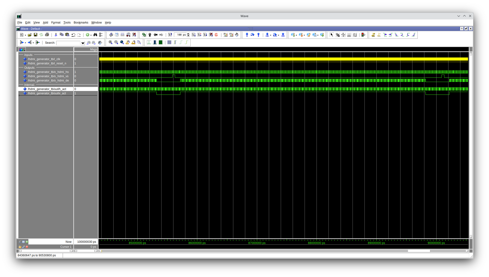
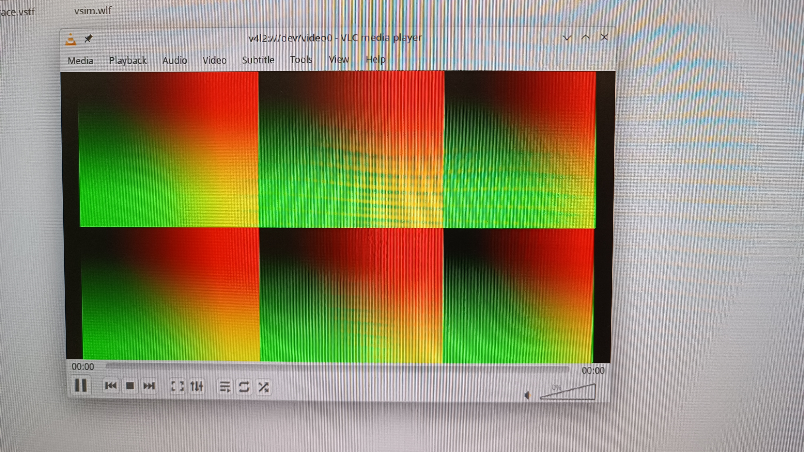

# 2425_ESE_FGPA_CRAONELLO_PACE

## 2. Petit projet : Bouncing ENSEA Logo

### 2.1 Contrôleur HDMI

2. Analysez l’entity :
— Quel est le rôle des différents paramètres définis en generic ?
— Quel est leur unité ?

> Rôle des paramètres generic :
> - h_res : Nombre de pixels actifs par ligne (largeur).
> - v_res : Nombre de lignes actives (hauteur).
> - h_sync, v_sync : Durées des signaux de synchronisation (pixels/lignes).
> - h_fp, h_bp, v_fp, v_bp : Temporisations avant et après zones actives (pixels/lignes).

> Tous les paramètres sont exprimés en pixels (horizontal) ou lignes (vertical).

### 2.2 Affichage Logo ENSEA

Pour afficher le logo ENSEA via HDMI, une mémoire RAM est utilisée pour stocker les données du logo. Celui-ci occupe une taille de 95x95 pixels, chaque pixel étant codé en nuances de gris sur 8 bits. L'objectif initial était de permettre le déplacement du logo au cours du temps, mais cette fonctionnalité n'a pas été implémentée faute de temps.

### Affichage test-bench
Lorsque l'on simule notre composant HDMI sur un testbench prevue a cette effet on obtient bien les signaux attendu.
C'est a dire que le o_hmdi_de s'incremente lorsque le o_hmdi_hs et le o_hmdi_vs sont actifs.

On souhaite ensuite verifier que notre comportement HDMI fonctionne pour de vrai, on connecte alors les signaux o_x_counter et o_y_counter à deux
canaux de couleur, on obtient 
